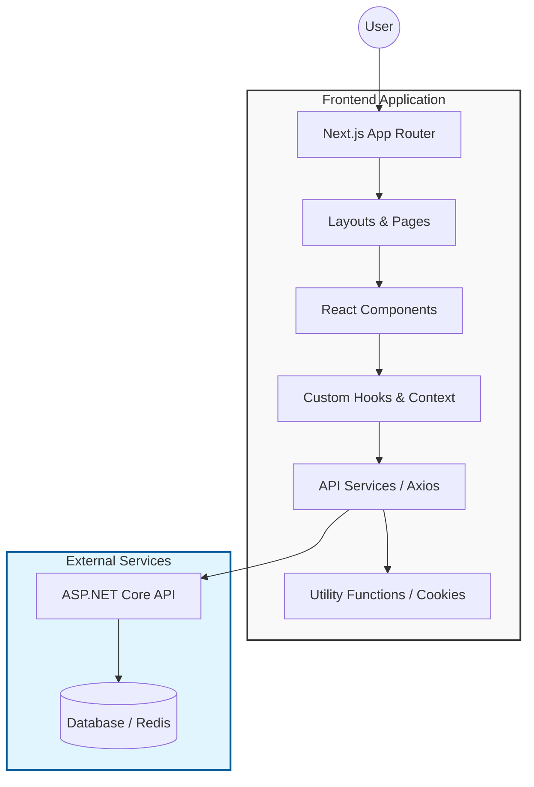

# Waffer - Frontend

Waffer is a resource optimization and donation management platform that connects charities with donor organizations. The platform facilitates the efficient distribution of resources by providing a centralized digital environment where charities can request assistance and donor organizations can offer supplies or food. By streamlining application tracking and fulfillment, Waffer ensures that resources are allocated where they are needed most, reducing waste and maximizing social impact.

## Features

- Resource Management: Centralized system for charities to post needs and donors to offer resources.
- Application Tracking: Real-time monitoring of the application lifecycle from submission to fulfillment.
- Organization Profiles: Detailed management for verified charities and donor organizations.
- Admin Verification: Robust administrative tools for monitoring platform activity and verifying entity integrity.
- Real-time Updates: Optimized data fetching and state management for a seamless user experience.

## Technologies Used

- Next.js
- React 19
- Tailwind CSS 4
- Axios
- JS-Cookie

## Architecture



This project follows a component-based architecture using Next.js App Router patterns. It utilizes CSS Modules and Tailwind CSS for styling, with a focus on reusable UI components and efficient API integration through Axios.

## Getting Started

### Prerequisites

- Node.js (version 18 or higher)
- npm or yarn

### Installation

```bash
# Clone the repository
git clone https://github.com/Youssef-M-Salama/app-client.git

# Navigate to the project directory
cd app-client

# Install dependencies
npm install

# Run the development server
npm run dev
```
